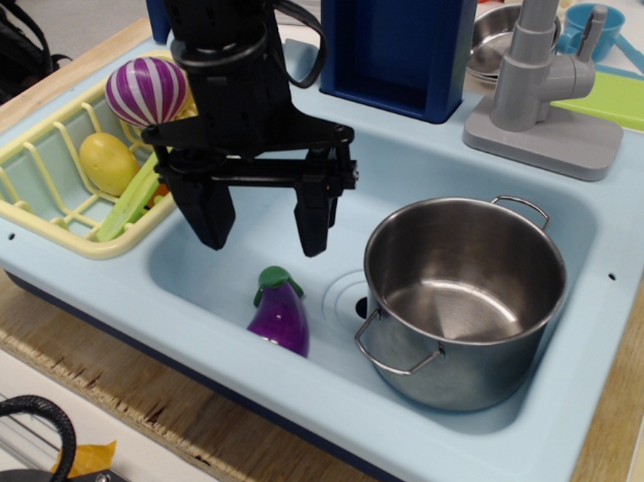
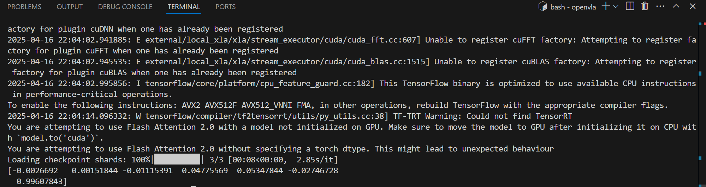
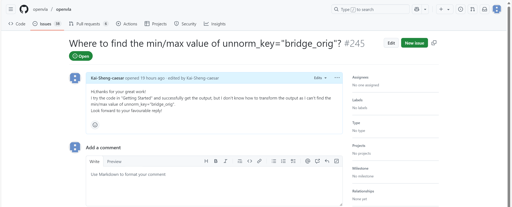
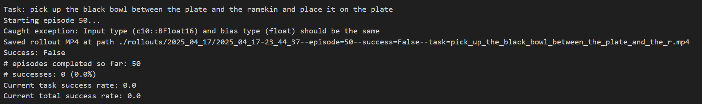

# OpenVLA复现及LIBERO数据集上微调
## 配置环境及准备工作

### 克隆OpenVLA仓库
```
# Create and activate conda environment
conda create -n openvla python=3.10 -y
conda activate openvla

# Install PyTorch. Below is a sample command to do this, but you should check the following link
# to find installation instructions that are specific to your compute platform:
# https://pytorch.org/get-started/locally/
conda install pytorch torchvision torchaudio pytorch-cuda=12.4 -c pytorch -c nvidia -y  # UPDATE ME!

# Clone and install the openvla repo
git clone https://github.com/openvla/openvla.git
cd openvla
pip install -e .

# Install Flash Attention 2 for training (https://github.com/Dao-AILab/flash-attention)
#   =>> If you run into difficulty, try `pip cache remove flash_attn` first
pip install packaging ninja
ninja --version; echo $?  # Verify Ninja --> should return exit code "0"
pip install "flash-attn==2.5.5" --no-build-isolation
```
> 对于无法连接到github有以下方法
> 
> 执行`cd openvla`，`pip install -e .`时报错无法连接github上的dlimp_openvla
>
> 1、添加本地代理
> 
> 2、手动下载https://github.com/moojink/dlimp_openvla 进行`pip install -e .`
> 
> 后续Flash Attention 2进行安装也报错
> 
> 手动下载flash_attn-2.7.3+cu12torch2.5cxx11abiFALSE-cp310-cp310-linux_x86_64.whl
> 
> 原本要求的flash_attn_2.5.5对应cuda版本为12.2，尝试使用符合版本的2.7.3
>
> 由于无法连接到github，尝试手动安装whl进行编译
>
> 3、编辑`pyproject.toml`或者`setup.py`中的下载链接，采用国内镜像站kkgithub、hf.mirror等国内镜像源进行`pip install -e .`
>
> 采用第2种方法完成了flash_attn_2.7.3的安装
>
> 
> 采用第3种方法完成了openvla中的`pip install -e .`
#### 后续...
> flash_attn_2.7.3在测试运行`test.py`测试代码报错，原作者说一定要使用他的版本！确实没说错，复现一定要尽可能使用相同的环境！
>
> 后续将flash_attn_2.7.3换成了作者要求的flash_attn_2.5.5

### 克隆LIBERO仓库
```
git clone https://github.com/Lifelong-Robot-Learning/LIBERO.git
cd LIBERO
pip install -e .
```

### 安装其余LEBERO相关库
```
cd openvla
pip install -r experiments/robot/libero/libero_requirements.txt
```
> 出现如下报错：
```
ERROR: pip's dependency resolver does not currently take into account all the packages that are installed. This behaviour is the source of the following dependency conflicts.
torch 2.5.1 requires sympy==1.13.1, but you have sympy 1.13.3 which is incompatible.
```
> 需要更换sympy库版本为1.13.1与torch2.5.1适配，执行以下命令
```
pip install sympy==1.13.1
```

## 测试基础的openvla-7b模型，运行官方示例test.py
> `test.py`:
```
# Install minimal dependencies (`torch`, `transformers`, `timm`, `tokenizers`, ...)
# > pip install -r https://raw.githubusercontent.com/openvla/openvla/main/requirements-min.txt
from transformers import AutoModelForVision2Seq, AutoProcessor
from PIL import Image

import torch

# Load Processor & VLA
processor = AutoProcessor.from_pretrained('./openvla7b', trust_remote_code=True)
vla = AutoModelForVision2Seq.from_pretrained(
    './openvla7b',
    attn_implementation="flash_attention_2",  # [Optional] Requires `flash_attn`
    torch_dtype=torch.bfloat16, 
    low_cpu_mem_usage=True, 
    trust_remote_code=True
).to("cuda:0")

# Grab image input & format prompt


image: Image.Image = Image.open("./test.png")
# prompt = "In: What action should the robot take to {<INSTRUCTION>}?\nOut:"
prompt = "In: What action should the robot take to {<put eggplant in bowl>}?\nOut:"

# Predict Action (7-DoF; un-normalize for BridgeData V2)
inputs = processor(prompt, image).to("cuda:0", dtype=torch.bfloat16)
action = vla.predict_action(**inputs, unnorm_key="bridge_orig", do_sample=False)

print(action)

# Execute...
# robot.act(action, ...)
```
> 完善示例代码中的图片读取，测试图片为：


> 完善示例代码中的prompt，文本提示为：
>
> `prompt = "In: What action should the robot take to {<put eggplant in bowl>}?\nOut:"`
>
> 结果为：


>输出为`[-0.0026692 0.00151844 -0.01115391 0.04775569 0.05347844 -0.02746728 0.99607843]`
>输出范围为[-1,1]，每个维度都划分了256个离散区间，1-3输出对应x,y,z的相对移动，4-6输出对应x,y,z的相对旋转，7输出对应夹爪开关及力度
>针对不同数据集，划分总区间不同，参照`unnorm_key="bridge_orig"`，但是`unnorm_key="bridge_orig"`对应的总区间我没有在文章或代码中找到，期待作者答复


## 验证官方openvla-7b-finetuned-libero-spatial模型，进一步复现

### 下载openvla-7b-finetuned-libero-spatial模型及libero-spatial（空间位置）数据集用以后续复现及微调工作
> 下载官方修改后的libero-spatial数据集`libero-spatial-no-noops`

### 使用官方针对上述数据集微调的openvla-7b-finetuned-libero-spatial模型进行验证
> 运行下列代码：
```
python experiments/robot/libero/run_libero_eval.py \
  --model_family openvla \
  --pretrained_checkpoint "openvla-7b-finetuned-libero-spatial" \
  --task_suite_name libero_spatial \
  --center_crop True
```
> 遇到的各种报错及解决方法：
> 
> 1、服务器连接不上huggingface
> 
> 改成加载本地模型参数，修改openvla/experiments/robot/openvla_utils.py的get_vla(cfg)和get_processor(cfg)函数：
```
def get_vla(cfg):
        // ...
        vla = AutoModelForVision2Seq.from_pretrained(
            cfg.pretrained_checkpoint,
            local_files_only=True
            #attn_implementation="flash_attention_2",
            #torch_dtype=torch.bfloat16,
            #load_in_8bit=cfg.load_in_8bit,
            #load_in_4bit=cfg.load_in_4bit,
            #low_cpu_mem_usage=True,
            #trust_remote_code=True,
        )
        // ...
    
    // ...
    def get_processor(cfg):
        """Get VLA model's Hugging Face processor."""
        processor = AutoProcessor.from_pretrained(
                  cfg.pretrained_checkpoint, 
                  local_files_only=True,
                  # trust_remote_code=True
        )
        return processor
```
> 2、数据集位置
>
> 数据集位置下载到默认位置`libero/libero/datasets`
>
> 3、服务器运行无法输入y/n导致报错
>
> 在`libero/libero/_init_.py`中取消下面代码中的输入部分，改为`answer = "n"`：
```
if not os.path.exists(config_file):
    # Create a default config file

    default_path_dict = get_default_path_dict()
    # answer = input(
    #     "Do you want to specify a custom path for the dataset folder? (Y/N): "
    # ).lower()
    answer = "n"
```
> 4、类型不匹配报错，成功率一直为0.00%


> 修改openvla_utils.py的get_vla_action函数，倒数第三行：
> 
> `inputs = processor(prompt, image).to(DEVICE, dtype=torch.float32)`
>
> 5、`openvla/prismatic/extern/hf/modeling_prismatic.py`报错，修改如下:
```
if not torch.all(input_ids[:, -1] == 29871):
    #input_ids = torch.cat(
    #    (input_ids, torch.unsqueeze(torch.Tensor([29871]).long(), dim=0).to(input_ids.device)), dim=1
    #)
     input_ids[:, -1] = 29871 
```

## 自己尝试微调
### 在libero-spatial数据集上自己尝试使用LORA微调官方openvla-7b模型
> 参数设置batch_size=8，使用rank=32进行LORA微调
